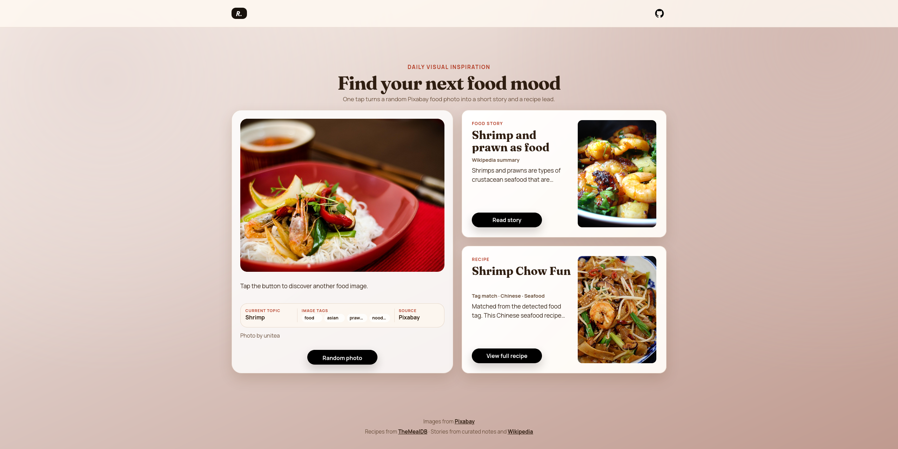

# RecipeAndStory

[Live Demo](https://recipeandstory.web.app/)



RecipeAndStory is a React and Vite web application that turns random food photos into small discovery cards with context and recipes. It fetches images from the Pixabay API, resolves a food topic from image tags, loads a short background note through the Wikipedia Summary API, and matches a relevant recipe from TheMealDB.

The project demonstrates external API integration, asynchronous state handling, fallback logic, modal UI, dynamic visual updates, and clean data presentation. Its purpose is to make food browsing more meaningful by connecting an image with context, source information, and a practical recipe.

## Features

- Random food photo on initial load.
- "Random photo" button to fetch a new image.
- Pixabay tag normalization with a confidence-gated curated food-topic resolver.
- Food story cards from curated notes with Wikipedia summary fallback.
- Recipe cards from TheMealDB with strict topic matching and no unrelated random fallback.
- Detail modals for full stories, instructions, ingredients, and source links.
- Smooth transition between images.
- Dynamic background color based on the selected photo.
- Link to the original Pixabay page and photo author attribution.

## Tech Stack

- React 19
- Vite 8
- CSS Modules
- Pixabay REST API
- TheMealDB free v1 API
- Wikipedia summary API

## Getting Started

### 1. Install dependencies

```bash
npm install
```

### 2. Configure environment variables

Create `.env` from `.env.example` and provide your Pixabay API key. TheMealDB v1 and Wikipedia summary requests do not need project-specific keys for this app.

```bash
cp .env.example .env
```

```env
VITE_PIXABAY_KEY=your_pixabay_api_key_here
```

You can get a key at [pixabay.com/api/docs](https://pixabay.com/api/docs/).

### 3. Run in development mode

```bash
npm run dev
```

## Available Scripts

- `npm run dev` - start local dev server.
- `npm run build` - build production bundle into `dist/`.
- `npm run preview` - preview the production build locally.
- `npm run lint` - run ESLint.

## Production Build

```bash
npm run build
```

The output will be generated in `dist/`.

## Deploy

The repository includes `firebase.json` configured for Firebase Hosting with SPA rewrites to `index.html`.
